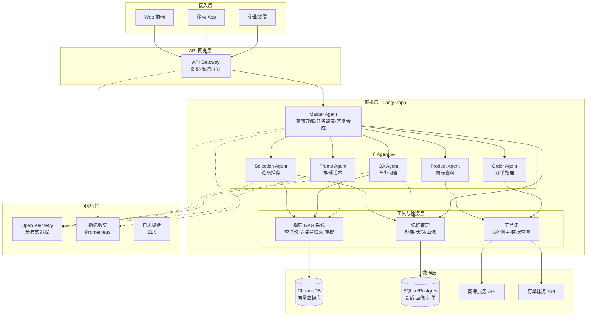
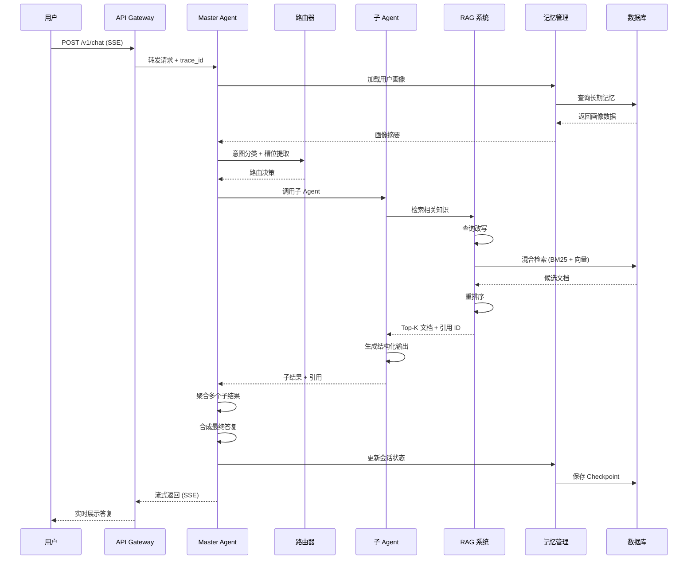

# 技术设计文档：高端母婴智能客服系统完整实现

## 概述

本文档基于现有的设计文档（设计文档-langgraph-multi-agent-customer-service.md），为高端母婴智能客服系统提供完整的技术设计。系统已实现基础的多 Agent 架构（Master、QA、Selection、Order、Product Agent）、RAG 检索和 SQLite 持久化。本设计将补充以下核心功能：

1. **推销子 Agent (Promo Agent)** - 合规的高转化话术生成
2. **完整的 API 服务层** - 流式 SSE、会话恢复、反馈收集
3. **增强的 RAG 系统** - 查询改写、混合检索、重排序、引用约束
4. **前端界面完善** - React 前端与 API 集成
5. **长期记忆与用户画像增强** - 偏好学习、过敏史管理
6. **可观测性与监控** - OpenTelemetry 追踪、指标收集

## 系统架构

### 整体架构图



### 主要数据流



## 核心组件设计

### 1. Promo Agent（推销子 Agent）

#### 职责
- 在合规前提下生成高转化话术
- 处理活动、套装、会员权益推荐
- 输出结构化的推销话术片段
- 与 Master Agent 协作，避免覆盖事实性内容

#### 接口定义

```python
class PromoAgentInput(BaseModel):
    """推销 Agent 输入"""
    user_query: str
    candidate_products: List[ProductInfo]  # 来自 Selection Agent
    active_promotions: List[PromotionRule]  # 当前活动规则
    user_profile: UserProfile  # 用户画像
    conversation_context: List[Message]  # 对话上下文
    constraints: PromoConstraints  # 合规约束

class PromoAgentOutput(BaseModel):
    """推销 Agent 输出"""
    promo_lines: List[str]  # 推销话术片段列表
    applied_promotions: List[str]  # 应用的活动 ID
    constraints_ok: bool  # 合规检查通过
    confidence: float  # 置信度 0-1
    notes: str  # 内部备注
    evidence_ids: List[str]  # 引用的活动规则 ID

class PromoConstraints(BaseModel):
    """合规约束"""
    max_discount_claim: float = 0.5  # 最大折扣声称
    forbidden_words: List[str] = ["最好", "第一", "治疗"]
    require_disclaimer: bool = True  # 需要免责声明
    tone: str = "professional"  # 语气：professional/friendly
```

#### 核心算法

```python
ALGORITHM generatePromoContent(input: PromoAgentInput) -> PromoAgentOutput
INPUT: 
  - user_query: 用户查询
  - candidate_products: 候选商品列表
  - active_promotions: 活动规则
  - user_profile: 用户画像
  - constraints: 合规约束

OUTPUT: PromoAgentOutput 结构化推销内容

PRECONDITIONS:
  - candidate_products 非空
  - active_promotions 已验证有效期
  - constraints 已加载

POSTCONDITIONS:
  - 所有 promo_lines 通过合规检查
  - 引用的活动规则真实存在
  - 不包含禁用词汇

BEGIN
  // 步骤 1: 检索相关活动规则
  relevant_promotions ← retrievePromotions(
    candidate_products, 
    active_promotions,
    user_profile.membership_level
  )
  
  // 步骤 2: 构建 Prompt 上下文
  prompt_context ← buildPromoPrompt(
    user_query,
    candidate_products,
    relevant_promotions,
    user_profile,
    constraints
  )
  
  // 步骤 3: LLM 生成推销话术
  raw_output ← llm.invoke(prompt_context)
  
  // 步骤 4: 结构化解析
  parsed_output ← parsePromoOutput(raw_output)
  
  // 步骤 5: 合规检查
  compliance_result ← checkCompliance(
    parsed_output.promo_lines,
    constraints
  )
  
  IF NOT compliance_result.passed THEN
    // 重试或降级
    parsed_output.promo_lines ← filterNonCompliant(
      parsed_output.promo_lines,
      compliance_result.violations
    )
  END IF
  
  // 步骤 6: 添加引用和元数据
  output ← PromoAgentOutput(
    promo_lines = parsed_output.promo_lines,
    applied_promotions = [p.id FOR p IN relevant_promotions],
    constraints_ok = compliance_result.passed,
    confidence = calculateConfidence(parsed_output),
    evidence_ids = [p.doc_id FOR p IN relevant_promotions]
  )
  
  RETURN output
END

LOOP INVARIANTS:
  - 每次迭代后 promo_lines 数量不超过配置上限
  - 所有已生成的话术片段均通过合规检查
```

#### Prompt 模板

```python
PROMO_SYSTEM_PROMPT = """
你是高端母婴品牌的专业导购顾问。你的任务是在严格合规的前提下，
生成有吸引力的推销话术。

## 品牌调性
- 专业、克制、可验证
- 强调品质、品控、正品保障
- 避免过度口语化和强压单

## 严格禁止
- 使用绝对化用语（最好、第一、唯一）
- 做出医疗承诺或疗效声称
- 贬低竞品
- 虚假折扣或夸大优惠

## 输出格式
以 JSON 格式输出：
{{
  "promo_lines": ["话术1", "话术2"],
  "rationale": "选择理由"
}}

## 当前活动规则
{promotion_rules}

## 用户画像
- 会员等级：{membership_level}
- 偏好品类：{preferred_categories}
- 消费能力：{price_sensitivity}
"""

PROMO_USER_PROMPT = """
用户查询：{user_query}

候选商品：
{candidate_products}

请生成 1-3 条推销话术，突出活动优势和会员权益。
"""
```

### 2. 增强的 RAG 系统

#### 架构设计

```python
class EnhancedRAGSystem:
    """增强的 RAG 系统"""
    
    def __init__(
        self,
        vector_store: VectorStore,
        bm25_index: BM25Index,
        reranker: Reranker,
        query_rewriter: QueryRewriter
    ):
        self.vector_store = vector_store
        self.bm25_index = bm25_index
        self.reranker = reranker
        self.query_rewriter = query_rewriter
    
    def retrieve(
        self,
        query: str,
        intent: str,
        slots: Dict[str, Any],
        top_k: int = 5,
        enable_rerank: bool = True
    ) -> List[Document]:
        """混合检索 + 重排序"""
        pass
```

#### 查询改写算法

```python
ALGORITHM rewriteQuery(
    original_query: str,
    intent: str,
    slots: Dict,
    conversation_history: List[Message]
) -> List[str]

INPUT:
  - original_query: 原始用户查询
  - intent: 意图标签（selection/qa/promo）
  - slots: 提取的槽位（月龄、品类、价格等）
  - conversation_history: 对话历史

OUTPUT: 改写后的查询列表（支持多查询）

PRECONDITIONS:
  - original_query 非空
  - intent 在预定义集合中

POSTCONDITIONS:
  - 返回 1-3 个改写查询
  - 每个查询包含关键槽位信息

BEGIN
  rewritten_queries ← []
  
  // 策略 1: 槽位扩展
  IF slots 非空 THEN
    expanded_query ← expandWithSlots(original_query, slots)
    rewritten_queries.append(expanded_query)
  END IF
  
  // 策略 2: 意图特化
  intent_specific_query ← specializeByIntent(
    original_query,
    intent
  )
  rewritten_queries.append(intent_specific_query)
  
  // 策略 3: 上下文融合（多轮对话）
  IF conversation_history 长度 > 1 THEN
    context_query ← fuseWithContext(
      original_query,
      conversation_history[-3:]  // 最近 3 轮
    )
    rewritten_queries.append(context_query)
  END IF
  
  // 去重
  rewritten_queries ← deduplicate(rewritten_queries)
  
  RETURN rewritten_queries
END

EXAMPLE:
  原始查询: "有没有适合的奶粉"
  槽位: {age_months: 6, allergies: ["乳糖"]}
  意图: "selection"
  
  改写结果:
  1. "6个月宝宝 无乳糖 奶粉推荐"
  2. "婴儿配方奶粉 适合6月龄 乳糖不耐受"
  3. "水解奶粉 半岁宝宝"
```

#### 混合检索算法

```python
ALGORITHM hybridRetrieval(
    queries: List[str],
    filters: Dict,
    top_k: int
) -> List[Document]

INPUT:
  - queries: 改写后的查询列表
  - filters: 过滤条件（品类、价格区间等）
  - top_k: 返回文档数量

OUTPUT: 候选文档列表（带分数）

BEGIN
  all_candidates ← []
  
  // 并行检索
  FOR EACH query IN queries DO
    // BM25 关键词检索
    bm25_results ← bm25_index.search(
      query, 
      top_k=top_k*2,
      filters=filters
    )
    
    // 向量语义检索
    vector_results ← vector_store.similarity_search(
      query,
      top_k=top_k*2,
      filters=filters
    )
    
    // 合并结果
    all_candidates.extend(bm25_results)
    all_candidates.extend(vector_results)
  END FOR
  
  // 去重（保留最高分）
  unique_candidates ← deduplicateByDocId(all_candidates)
  
  // 融合分数（RRF - Reciprocal Rank Fusion）
  FOR EACH doc IN unique_candidates DO
    doc.fused_score ← calculateRRF(
      doc.bm25_rank,
      doc.vector_rank,
      k=60  // RRF 参数
    )
  END FOR
  
  // 排序
  sorted_candidates ← sortByScore(unique_candidates, desc=True)
  
  RETURN sorted_candidates[:top_k*3]  // 返回 3 倍候选，供重排
END

FUNCTION calculateRRF(bm25_rank, vector_rank, k) -> float
  // Reciprocal Rank Fusion
  rrf_score ← 0
  
  IF bm25_rank > 0 THEN
    rrf_score += 1.0 / (k + bm25_rank)
  END IF
  
  IF vector_rank > 0 THEN
    rrf_score += 1.0 / (k + vector_rank)
  END IF
  
  RETURN rrf_score
END
```

#### 重排序算法

```python
ALGORITHM rerank(
    query: str,
    candidates: List[Document],
    top_k: int
) -> List[Document]

INPUT:
  - query: 原始查询
  - candidates: 候选文档列表
  - top_k: 最终返回数量

OUTPUT: 重排后的 Top-K 文档

BEGIN
  // 使用交叉编码器重排
  reranked_docs ← []
  
  FOR EACH doc IN candidates DO
    // 计算查询-文档相关性分数
    relevance_score ← cross_encoder.predict(
      query,
      doc.content
    )
    
    doc.rerank_score ← relevance_score
    reranked_docs.append(doc)
  END FOR
  
  // 按重排分数排序
  sorted_docs ← sortByScore(reranked_docs, key="rerank_score", desc=True)
  
  // 添加引用 ID
  FOR i ← 0 TO min(top_k, len(sorted_docs)) - 1 DO
    sorted_docs[i].citation_id ← generateCitationId(sorted_docs[i])
  END FOR
  
  RETURN sorted_docs[:top_k]
END

FUNCTION generateCitationId(doc: Document) -> str
  // 生成可追溯的引用 ID
  // 格式: {source_type}_{doc_id}_{chunk_id}
  // 例如: product_SKU12345_chunk_2
  
  RETURN f"{doc.source_type}_{doc.doc_id}_{doc.chunk_id}"
END
```

#### 引用约束机制

```python
ALGORITHM enforceCitationConstraints(
    generated_text: str,
    retrieved_docs: List[Document],
    strict_mode: bool = True
) -> Tuple[str, List[Citation]]

INPUT:
  - generated_text: LLM 生成的文本
  - retrieved_docs: 检索到的文档列表
  - strict_mode: 严格模式（拒绝无引用内容）

OUTPUT: (修正后的文本, 引用列表)

BEGIN
  citations ← []
  verified_text ← generated_text
  
  // 提取文本中的事实性陈述
  factual_claims ← extractFactualClaims(generated_text)
  
  FOR EACH claim IN factual_claims DO
    // 在检索文档中验证
    supporting_doc ← findSupportingDocument(claim, retrieved_docs)
    
    IF supporting_doc 存在 THEN
      // 添加引用
      citation ← Citation(
        claim=claim,
        doc_id=supporting_doc.citation_id,
        excerpt=supporting_doc.relevant_excerpt
      )
      citations.append(citation)
    ELSE IF strict_mode THEN
      // 严格模式：移除无法验证的陈述
      verified_text ← removeOrRephrase(verified_text, claim)
    END IF
  END FOR
  
  // 添加引用标记到文本
  annotated_text ← addCitationMarkers(verified_text, citations)
  
  RETURN (annotated_text, citations)
END

FUNCTION findSupportingDocument(claim, docs) -> Document
  max_similarity ← 0
  best_doc ← None
  
  FOR EACH doc IN docs DO
    similarity ← semanticSimilarity(claim, doc.content)
    IF similarity > max_similarity AND similarity > 0.7 THEN
      max_similarity ← similarity
      best_doc ← doc
    END IF
  END FOR
  
  RETURN best_doc
END